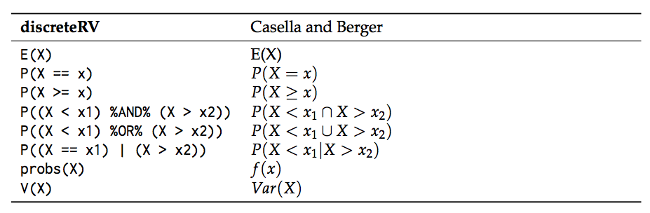
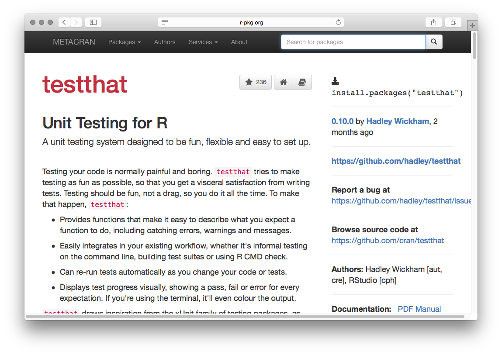
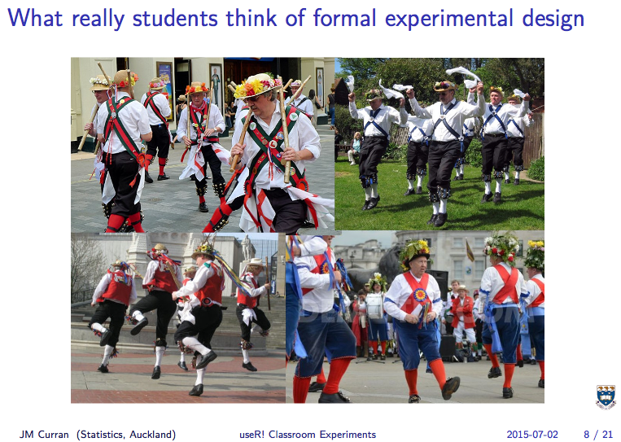
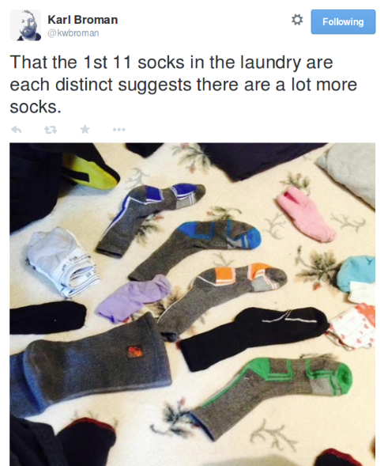
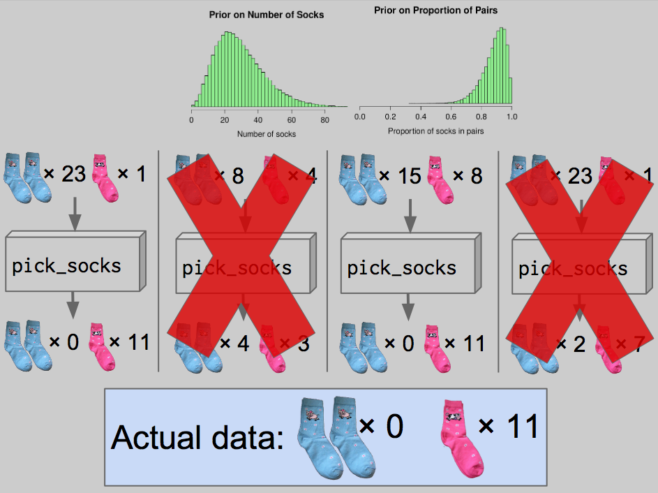
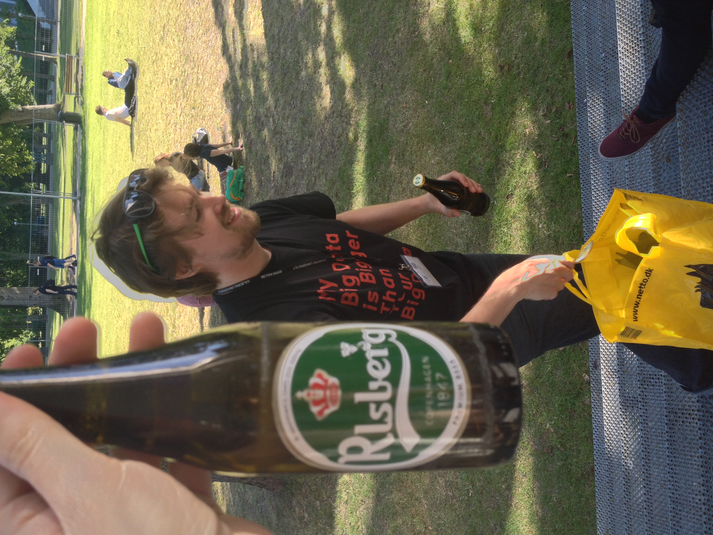
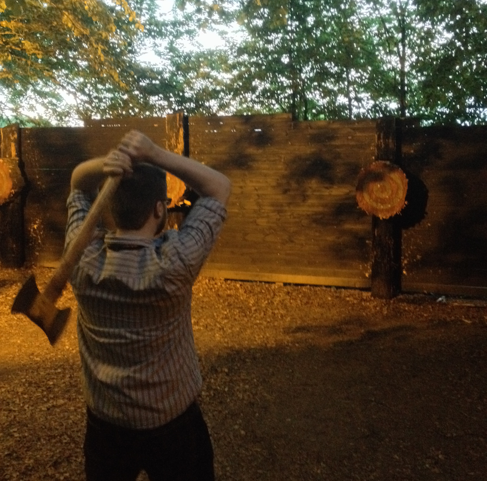
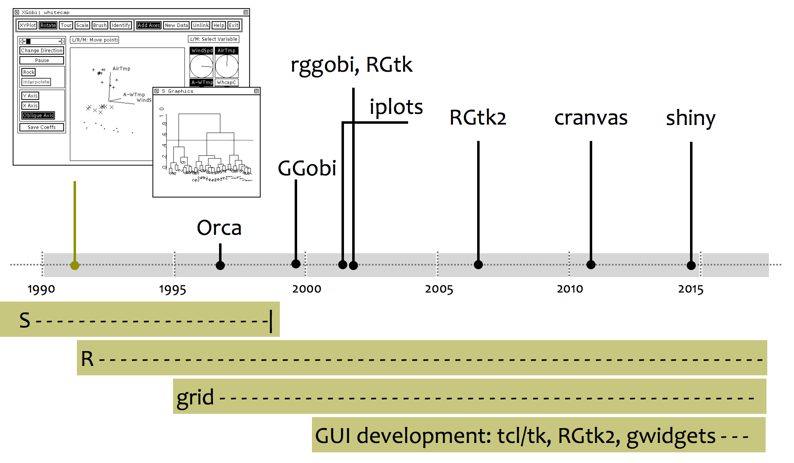

##

<p align="center"><big>useR! 2015 highlights</big><br/><br/>
David L Miller<br/><br/>
CREEMcrackers<small><br/>
CREEM, University of St Andrews<br/>
31 July 2015</small>
<br/>
<br/>
<br/>
<br/>
<br/>
</p>


#

<div class="bigquote">General thoughts</div>

# useR! 2015 in general

  * Still a weird (in a good way) conference
  * Huge range of talks
  * Standard of talks much higher than in previous years
  * [Complete list of talks, some with slides online](http://user2015.math.aau.dk/oral_sessions)

<div align="right"></div>


#

<div class="bigquote">Talks I attended</div>


# `archivist`: Tools for Storing, Restoring and Searching for R Objects

  * Przemysław Biecek, University of Warsaw
  * During analysis we create "artifacts" -- subsets, aggregations, plots, models $\Rightarrow$ `git`
  * `archivist` stores the artifacts and *relations between* them (if you use pipes `%a%`)
  * tags are generated from `ggplot2` plots from labels, can be added for others
  * [pbiecek.github.io/archivist/](http://pbiecek.github.io/archivist/)


# Manipulation of Discrete Random Variables in R with `discreteRV`

  * Eric Hare, Iowa State University
  * Bridge the gap between maths and R
  * [Paper](http://journal.r-project.org/archive/2015-1/hare-buja-hofmann.pdf)



# The METACRAN experiment

  * Gabor Csardi, Harvard
  * Make things easier to find on CRAN
  * Between github and CRAN, everything you need in one place
  * [r-pkg.org](http://www.r-pkg.org)



# Classroom experiments

  * James Curran, University of Auckland ([slides](http://user2015.math.aau.dk/presentations/22.pdf))
  * How to teach "modern" intro to stats?
  * Data collection? (But not time consuming/prone to failure?)
  * R benchmarks as non-messy experiment




# Tiny Data, Approximate Bayesian Computation and the Socks of Karl Broman

  * Rasmus Bååth, Lund University ([slides](http://user2015.math.aau.dk/presentations/33.pdf)) ([15 min talk](http://www.sumsar.net/blog/2015/07/tiny-data-and-the-socks-of-karl-broman-the-movie/)) ([blog](http://www.sumsar.net/blog/2014/10/tiny-data-and-the-socks-of-karl-broman/))
  * Excellent explanation of ABC (data+generative model+prior+criteria)




#

<div class="bigquote">The talk I wish I'd attended</div>

# Plotting data as music videos in R

  * Thomas Levine ([slides/explanation](https://thomaslevine.com/!/user-2015/))
  * We use scatterplots a lot
  * What about using music or kebabs?


#

<div class="bigquote">Other stuff</div>

# Other stuff

  * [rOpenSci](https://ropensci.org/)
    * Access to a **lot** of data (NOAA, eBird, BISON, etc)
    * Access to journals/data repositories (PLOS, figshare, ORCID, etc)
    * Bindings to `git`, databases, [lots more](https://ropensci.org/packages/)
  * `leaflet` -- interactive maps ([site](https://rstudio.github.io/leaflet/))
    - Not 100% sure how useful they are in an ecological setting (yet)
  * Groundswell towards: `RCpp`, `dplyr`, `shiny`, `magrittr`

<div align="right"></div>

#

<div class="bigquote">Other highlights</div>

# {.cover}



# {.cover}




# {.cover}


<div class="bigquotew">Thanks!</div>

<div class="bigquote">Talks I (Rob) attended</div>

  * Reproducibility
  * Visualisation (who would have guessed?)

<div class="bigquote">Reproducibility</div>


# Package Cohorts
<div align="center"></div>

  * 4 Pillars of Data Analysis: data, code, statistical methods, software used
  * Software used: _Including Specific Versions_
  * Versioned Package Cohort
  * Two approaches: 

# Simple Reproducibility with `checkpoint` package

  * David Smith, Microsoft (nee Revolutions)
  * Uses `MRAN`: Microsoft R Archive Network
  * Easy, if heavy handed, way to create unique snapshots of current R environments and packages
  
     ```library(checkpoint)
   checkpoint(‘2015-01-28’) # only use package versions that existed at that date
   checkpoint(‘2015-01-28’, R.version = ‘3.1.1') # forces it to be the same R engine
   ```
   
   * [slides/explanation](http://www.slideshare.net/RevolutionAnalytics/checkpoint-user-2015)

# Switching R Environments with `switchr`

  * Gabriel Becker and Michael Lawrence (R Core Member), GenenTech
  * Developed to allow multiple distributed collaborators (~100) within Genentech to share R-based work
  * `switchr` provides a framework for creating, populating, managing, and switching between multiple package libraries from within an R session
  * `switchTo()`
  * `switchBack()`
  * [Vignette](https://cran.r-project.org/web/packages/switchr/vignettes/switchrvign.pdf)
  * [slides](http://user2015.math.aau.dk/presentations/97.pdf)
  
<div class="bigquote">Data Management</div>


# `readr`: Getting your data into R 

  * Hadley Wickham, RStudio
  * `readr` makes it easy to read many types of tabular data and do it more quickly (~10x speedup)
  * Better on factors; better on guessing variable types with 100-line scan
  * Delimited files with `read_delim()`, `read_csv()`, `read_tsv()`, and `read_csv2()`
  * Fixed width files with `read_fwf()`, and `read_table()`
  * Web log files with `read_log()`
  * `install.packages("readr")`
  * Outputs a `dplyr` class
  * [Vignette](http://blog.rstudio.org/2015/04/09/readr-0-1-0/)  
  
# Testing with `testwhat` package

  * Filip Schouwenaars, Datacamp
  * Built on `testthat`
  * Provide informative messages upon error
  * Relevant for CREEM: Allows for Submission Correctness Tests
  * `test_error()`, `test_function()`
  * [Documentation on writing SCTs](https://teach.datacamp.com/sct-design)
  
  <div align="right"></div>
  
# `assertr`: Failing fast and early: assertive/defensive programming for R data analysis pipelines 

  * Tony Fischetti, College Factual
  * Analysis errors are often errors in data, but can be impossible to detect _easily_
  * Provide info about how you expect the data to look
  * Deviations from these assumptions can be caught quickly
  * `mpg <- c(12.3, 45.2, 30.7, 23); mpg[2] <- - 1 * mpg[2]; mean(mpg)`
  * [Vignette](https://github.com/tonyfischetti/assertr/blob/master/vignettes/assertr.Rmd)
  * This led to an awkward moment...
  
# `ensurer` package already exists on CRAN 

  * Stephan Bache, Danske Commodities A/S
  * R does not provide any mechanism for type-safety and since it is not a compiled language, the risk of having unexpected results is there at runtime
  * [Vignette](https://github.com/smbache/ensurer/blob/master/vignettes/ensurer.Rmd)
  
  
# A proposal for distributed data-structures in R 

  * Indrajit Roy and Michael Lawrence, HP Labs and GenenTech
  * To scale computation, have to distribute data across multiple machines
  * Unified API for distributed computing. The API supports three shapes of data --- lists, arrays and data frames
  * [Blog Post](http://blog.revolutionanalytics.com/2015/02/the-hp-workshop-on-distributed-computing-in-r.html)
  
# Do Not Repeat Yourself Workflow

  * Pre-conference workshop from Peter Baker, University of Queensland
  * Scenarios
    * I have a very simple question that will only take 5 minutes. I won't need to see you again·
    * We have several data points that need deleting. Can you rerun the analysis, and insert the new tables and plot into our report by 4pm today?
    * The journal got back to us: Can you rerun the analysis to take account critisicms of our method? Its not the project we did last year but the one from 2009?
  * Focus on make, git, markdown
  * Keep directories same project to project
  * [package](https://github.com/petebaker/dryworkflow): sets up a git repo, and a standardised structure
  * [slides](https://petesstatsandr.wordpress.com/r-course-material/)
  
  
# Di Cook Plenary

  * Supervised two R-core members (Wickham & Lawrence)
  * Haven't progressed much in 20 years (XLispStat)
  * Tour of Tcl/Tk based interactive graphics
    * `Xwidgets`
    * `cranvas` [videos](https://vimeo.com/chxy/videos)
    * `RGtk`
    * `rggobi`
  
  <div align="right"></div>
  
# Di Cook Plenary - New Developments
  
  * ggvis
  * animint
  * gridSVG - from Paul Murrell (more later)
  * plotly
  * rbokeh
  * loon (more later)
  * shiny - but interaction isn't there yet (though see this [example](https://gallery.shinyapps.io/095-plot-interaction-advanced/))
   
# Di Cook Plenary - Challenges to Young Developers

  * Interaction on the plot (not there yet)
  * diff types of brushes - e.g. don’t just pick up one point, but also 5 nearest neighbours 
  * linking by a key variable 
  * Program linking and brushing systems
  * strong connection with model fitting (modellers need us)
  * portability, easy install, web compatible
  * large data
  * incorporate inference (generate lots of plots and cycle between them)
  * conceptual framework
  *
  * [slides](http://user2015.math.aau.dk/presentations/invited_di_cook.pdf)  


# d3
# shiny / htmlWidgets
# loon (note Tcl/Tk links to Cook’s talk)
# tmap package (include links to Axis Maps guidelines)
# gridGraphics & gridSVG
# teaching R: especial Potter (shiny) and Rundell (course management with github)